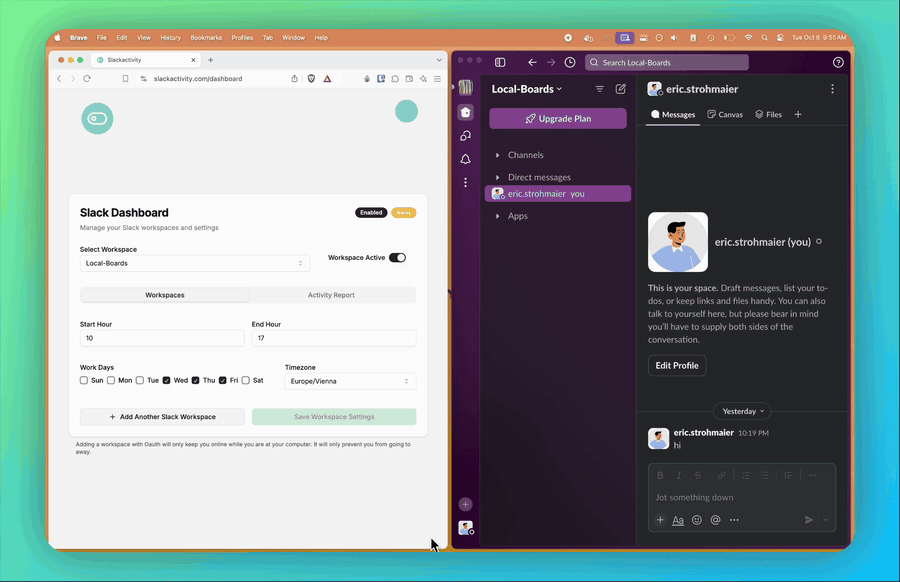

# Slackactivity — Keep Slack Active & Always Appear Online

**Automatically keep your Slack status green during your work hours.**
Stop Slack from setting you to "away" after 30 minutes of inactivity — no mouse jiggler, no hacks, just the official Slack API.

[**🚀 Use it free online → slackactivity.com**](https://slackactivity.com) · [How It Works](https://slackactivity.com/how-it-works) · [Guides](https://slackactivity.com/guides) · [Pricing](https://slackactivity.com/pricing)

---

## What is Slackactivity?

Slackactivity is a **Slack status automation tool** that keeps you **active and online on Slack** based on your work schedule and timezone. Slack automatically marks you as *away* after 30 minutes without activity — even if you're in a meeting, deep in focused work, or reading docs on another screen. That gray dot makes you look unavailable to your team and clients.

Slackactivity fixes that. Connect your workspace, set your working hours, and your **Slack presence stays green** — automatically, every 5 minutes, all day.

> **Free to use online — no install, no credit card.** Just sign in at [slackactivity.com](https://slackactivity.com) and connect your Slack workspace.

## ✨ Features

- 🟢 **Always appear online on Slack** — automatic active status during your configured hours
- ⏰ **Smart scheduling** — set custom work hours per day (Mon–Sun), your status follows your schedule
- 🌍 **Timezone aware** — detects your timezone automatically; perfect for remote work and distributed teams
- 🗂️ **Multiple Slack workspaces** — connect unlimited workspaces on the free plan, ideal for freelancers and consultants juggling client Slacks
- 🧩 **Per-workspace schedules** — different work hours for different clients or timezones
- 🏖️ **Vacation mode** — pause everything for a date range, automatically
- 🔀 **Workspace groups** — manage schedules for similar clients as one unit
- 🎛️ **One dashboard** — toggle, pause, and monitor all workspaces in one place

## 🔒 Security & Privacy

Slackactivity uses the **official Slack OAuth API** — no browser extensions, no keyboard simulators, no mouse jigglers, no workarounds that violate workspace policies.

- Requests only the `users.profile:write` scope
- **Cannot read your messages**, files, channels, or any workspace content
- Disconnect any workspace at any time with one click

## 🚀 How It Works (3 steps)

1. **Connect your workspace** — sign in with Slack OAuth at [slackactivity.com](https://slackactivity.com)
2. **Set your availability** — define working hours and timezone (per workspace if you like)
3. **Stay green** — Slackactivity keeps your Slack status active while you focus on real work

## 💚 Who is it for?

- **Remote workers & digital nomads** who work flexible hours across timezones and want their Slack availability to reflect their real schedule
- **Freelancers & consultants** managing 3–5+ client Slack workspaces who want to look responsive everywhere
- **Team leads & product managers** who are in meetings all day but still want to appear reachable
- Anyone tired of Slack's **auto-away timeout** making them look offline while they're actually working

## 💸 Pricing

| Plan | Price | Includes |
|---|---|---|
| **Free** | €0 forever | Unlimited workspaces, automatic status updates |
| **Monthly Pro** | €7.99/month | Pro features for a single workspace |
| **Lifetime** | €39.99 one-time / workspace | All Pro features, lifetime updates, VIP support |

No credit card required to start → [slackactivity.com](https://slackactivity.com)

## 🛠️ Tech Stack

Built with [Next.js](https://nextjs.org) (App Router), [Supabase](https://supabase.com), [Slack Web API](https://api.slack.com/web), Tailwind CSS, Radix UI, and Stripe.

## ❓ FAQ

**Does this keep my Slack status green without a mouse jiggler?**
Yes — Slackactivity is a mouse-jiggler alternative that works through the official Slack API. Nothing runs on your machine; it works even when your laptop is closed.

**Will Slack mark me as away after 30 minutes?**
Not during your configured working hours. Slackactivity refreshes your presence every 5 minutes so you stay online on Slack.

**Can I use it with multiple Slack workspaces?**
Yes, unlimited workspaces on the free plan — each with its own schedule.

**Is it safe?**
It uses Slack's official OAuth flow and only the `users.profile:write` permission. It can't read messages or access workspace data.

---

**Keep your Slack status green. Stay visible. Focus on real work.**

[**Get started free at slackactivity.com →**](https://slackactivity.com)

